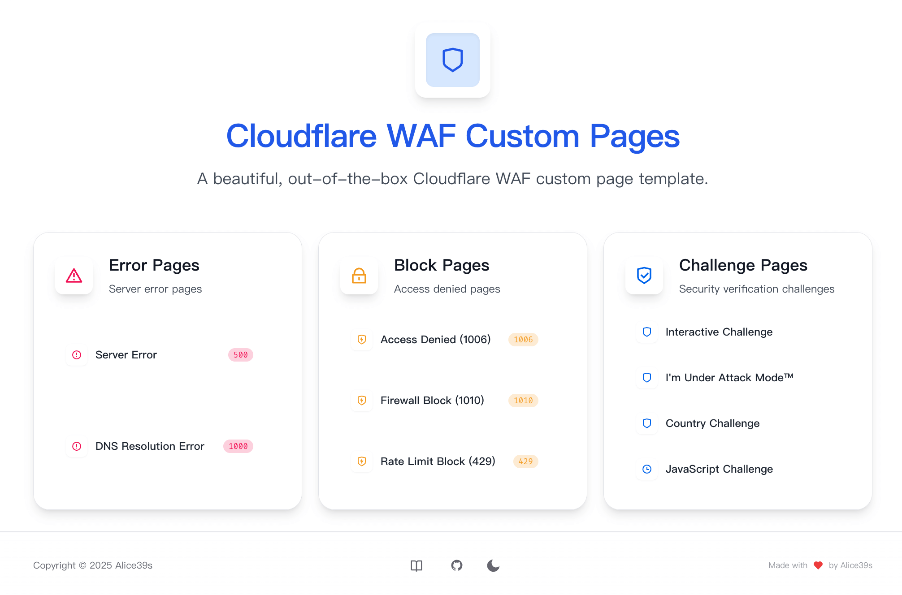
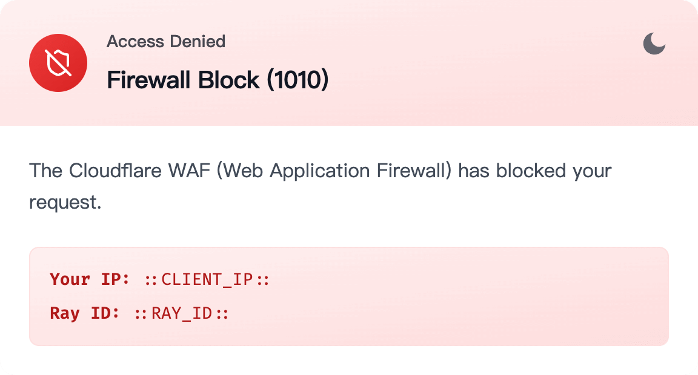
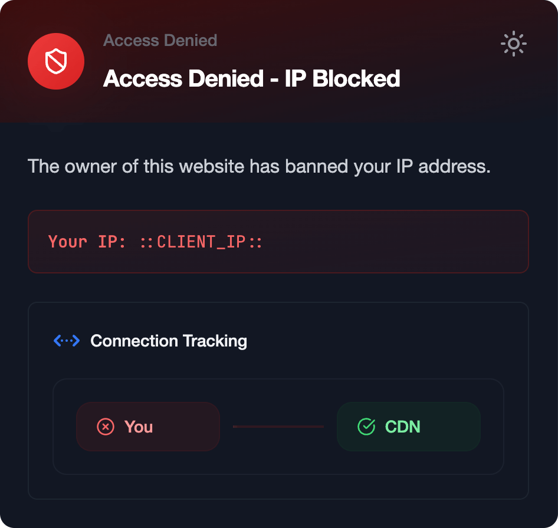
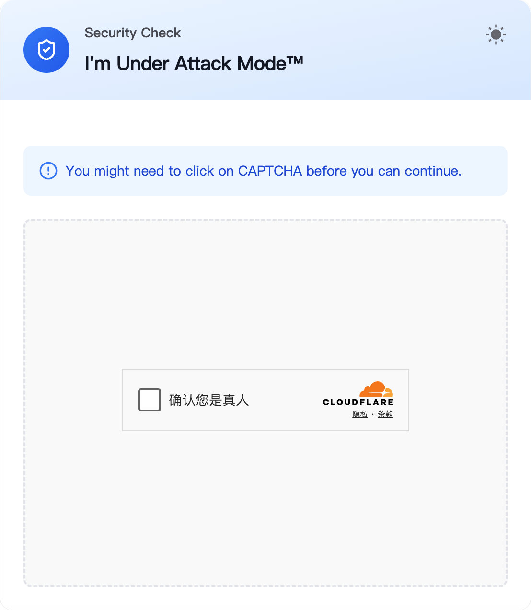
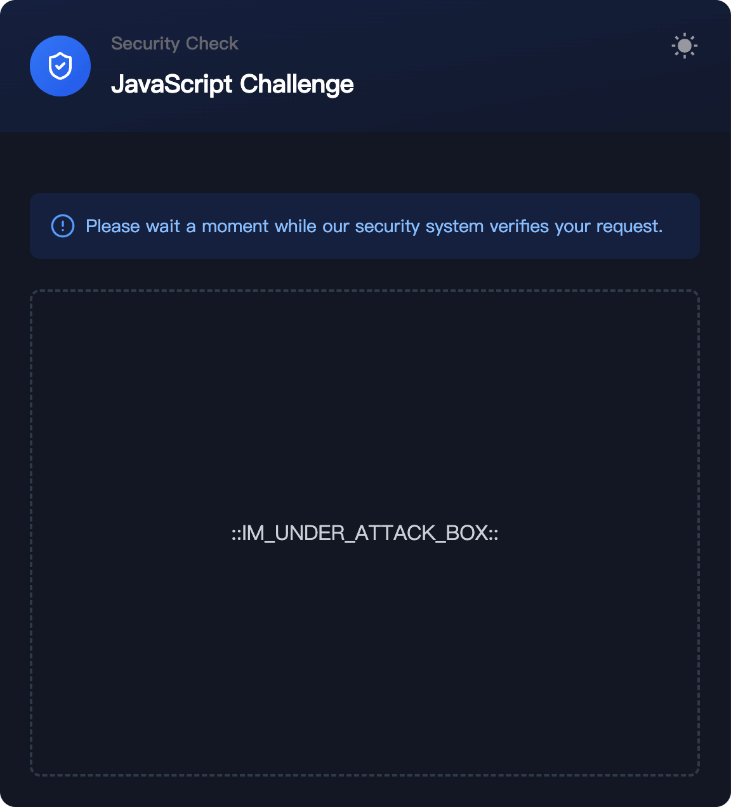

# 🌐 Cloudflare Custom Pages - Next.js

A set of elegant, out-of-the-box Cloudflare WAF Custom Page Templates implemented using **Next.js**, **Tailwind CSS**, and **HeroUI**. Built with Next.js 15, TypeScript, and Tailwind CSS, featuring responsive design, dark mode support, and automatic Cloudflare variable replacement.

English | [简体中文](README.zh.md) | [Online Demo](https://cw-preview.000000039.xyz/)

> [!TIP]
> Please comply with the project's [Open Source License](LICENSE) when making modifications.

## 📸 Screenshots

<div align="center">
    
    <br> Main Page
</div>

|                             Light                              |                            Dark                            |
| :------------------------------------------------------------: | :--------------------------------------------------------: |
|    Block from WAF   |   Block from IP   |
|  UAM (Under Attack Mode) |  JavaScript Challenge |

## ✨ Key Features

-   🎨 **Modern Responsive Design**: Sleek and contemporary layout optimized for all devices.
-   🌙 **Dark Mode Support**: Automatically adapts to system preferences for comfortable viewing.
-   🔒 **Full Coverage of Cloudflare Page Types**:
    -   `Block`: WAF interception pages
    -   `Error`: 1000s / 500s error pages
    -   `Captcha`: CAPTCHA challenge pages
-   📱 **Mobile-First Approach**: Guaranteed smooth experience on mobile devices.
-   🎭 **Automatic Cloudflare Variable Replacement**: Seamless integration of Cloudflare-specific variables.

## 🛠️ Tech Stack

-   **Next.js 15** + **React 19**
-   **HeroUI v2** + **Tailwind CSS v3**
-   **TypeScript**

## 🎯 Supported Variables

Currently supported automatic variable replacements:

-   `::CLIENT_IP::` - Client IP Address
-   `::RAY_ID::` - Cloudflare Ray ID
-   `::GEO::` - Client Geolocation
-   `::CLOUDFLARE_ERROR_500S_BOX::` - 500s Error Page Component
-   `::CLOUDFLARE_ERROR_1000S_BOX::` - 1000s Error Page Component
-   `::CAPTCHA_BOX::` - Cloudflare CAPTCHA Component
-   `::IM_UNDER_ATTACK_BOX::` - Cloudflare JavaScript Challenge Component

## 🔭 Usage

Quickly access Cloudflare Custom Pages via [this link](https://dash.cloudflare.com/?to=/:account/:zone/custom-pages).

> [!TIP]
> Your Cloudflare zone must be on Pro plan or higher to use these templates.

| Type        | Subtype                                     | Link                                 |
| ----------- | ------------------------------------------- | ------------------------------------ |
| Error Pages | Server Errors (500s)                        | [Import Link][error-500s]            |
|             | CF 1000s Errors                             | [Import Link][error-1000s]           |
| Block Pages | IP Block (1006)                             | [Import Link][block-ip]              |
|             | WAF Block (1010)                            | [Import Link][block-waf]             |
|             | Rate Limit Block (429)                      | [Import Link][block-rate-limit]      |
| Challenges  | Interactive Challenge                       | [Import Link][challenge-interactive] |
|             | Managed Challenge (I'm Under Attack Mode™) | [Import Link][challenge-managed]     |
|             | Country/Region Challenge                    | [Import Link][challenge-country]     |
|             | JavaScript Challenge                        | [Import Link][challenge-js]          |

[error-500s]: https://cw-preview.000000039.xyz/cf/error/500s/
[error-1000s]: https://cw-preview.000000039.xyz/cf/error/1000s/
[block-ip]: https://cw-preview.000000039.xyz/cf/block/ip/
[block-waf]: https://cw-preview.000000039.xyz/cf/block/waf/
[block-rate-limit]: https://cw-preview.000000039.xyz/cf/block/rate-limit/
[challenge-interactive]: https://cw-preview.000000039.xyz/cf/challenge/interactive/
[challenge-managed]: https://cw-preview.000000039.xyz/cf/challenge/managed/
[challenge-country]: https://cw-preview.000000039.xyz/cf/challenge/country/
[challenge-js]: https://cw-preview.000000039.xyz/cf/challenge/javascript/

## 🌍 Deployment Guide

-   **Deploy to Vercel (Recommended)**:

    [](https://vercel.com/new/clone?repository-url=https%3A%2F%2Fgithub.com%2FAlice39s%2Fcloudflare-custom-pages-nextjs%2Ftree%2Fmain&project-name=cloudflare-custom-pages-nextjs-fork&repository-name=cloudflare-custom-pages-nextjs-fork&demo-title=Online%20Demo&demo-description=A%20beautiful%2C%20out-of-the-box%20Cloudflare%20WAF%20custom%20page%20template.&demo-url=https%3A%2F%2Fcw-preview.000000039.xyz%2F)

-   **Manual Deployment**:

    ```bash
    bun run build
    # Ignore the following command if using Nginx/etc.
    bun run start
    ```

    `bun run start` launches a local server using `serve@latest`, listening on `0.0.0.0:3001` by default.

## 🚀 Development Guide

0. **Install Bun**:

    ```bash
    # macOS/Linux:
    curl -fsSL https://bun.sh/install | bash
    # Windows PowerShell:
    powershell -c "irm bun.sh/install.ps1 | iex"
    ```

1. **Clone Repository**:

    ```bash
    git clone https://github.com/Alice39s/cloudflare-custom-pages-nextjs.git
    ```

2. **Install Dependencies**:

    ```bash
    bun install
    ```

3. **Start Dev Server**:

    ```bash
    bun dev
    ```

4. **Build Production Version**:

    ```bash
    bun run build
    ```

## 🎨 Customization Guide

### 1. Site Configuration

Modify fields in `./config/site.ts` (name, description, etc.).

### 2. Content Customization

Edit `./config/routes.ts`. Example:

```ts
export const blockPages: Record<string, BlockPageConfig> = {
    ip: {
        type: "ip",
        title: "Access Denied (1006)",
        message: "The owner of this website has banned your IP address.",
        code: "1006",
    },
    ...
}
```

-   `type`: Used for routing (not recommended to modify without frontend experience).
-   `title`: Page title (editable).
-   `message`: Custom message (string only).
-   `code`: Error code for display purposes.

### 3. Component Styling

Project structure:

```
components/
├── cf/        # 🌩️ Cloudflare Components
├── home/      # 🏠 Homepage Components
└── layout/    # 🖼️ Global Layout Components
```

## 📜 License

Licensed under GPL v3.0. See [LICENSE](LICENSE) for details.
