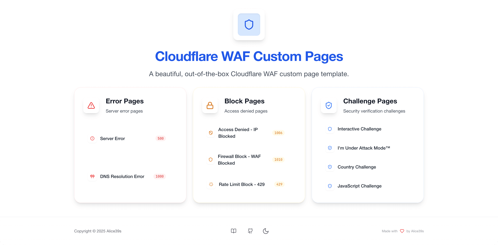
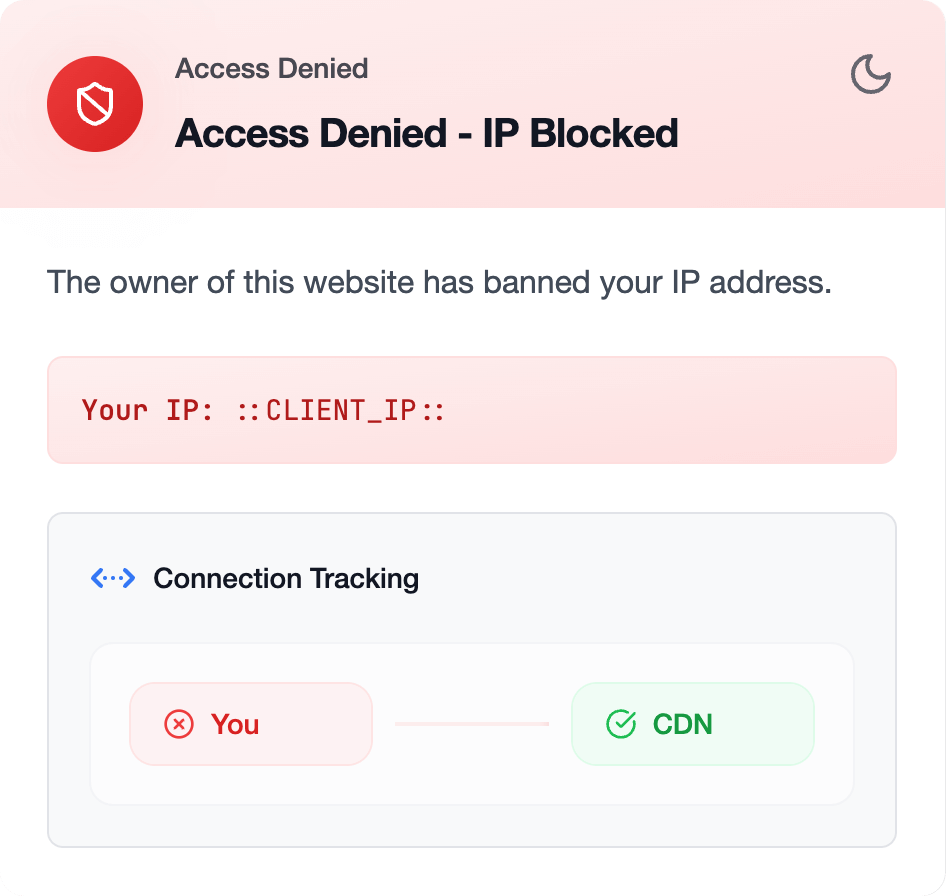
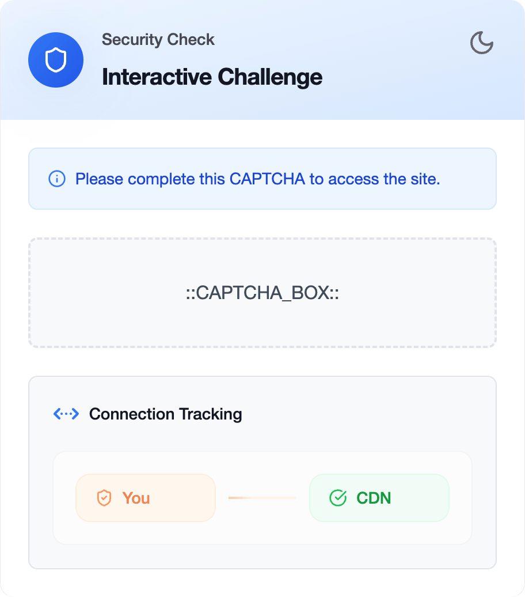
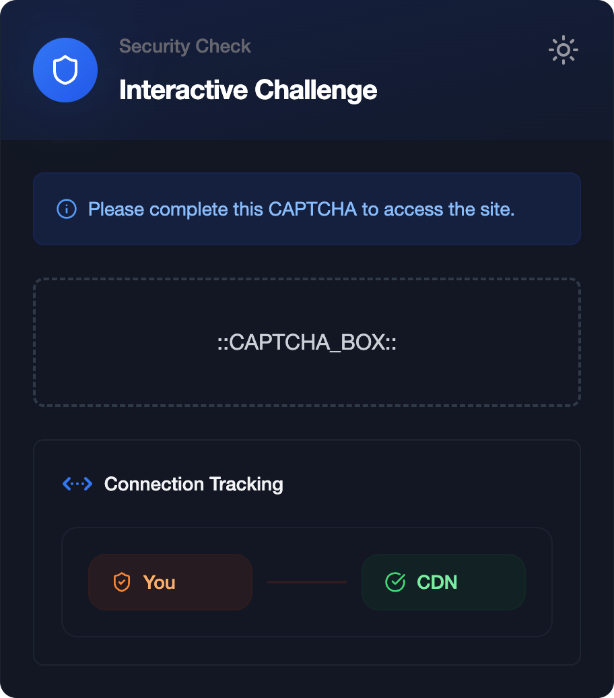
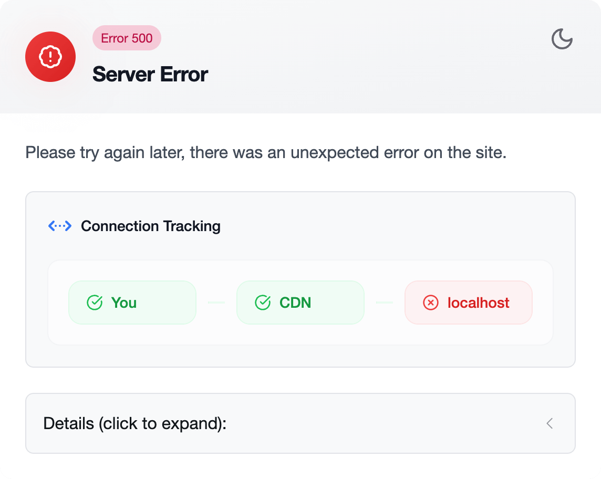
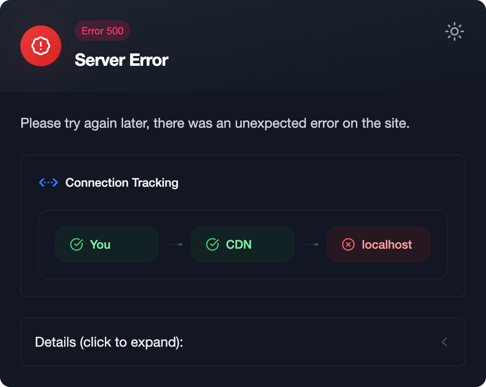

# 🌐 Cloudflare Custom Pages - Next.js

使用 **Next.js**、**Tailwind CSS** 和 **HeroUI** 实现一套美观的、开箱即用的 Cloudflare WAF 自定义页面模板。本模板基于 Next.js 15、使用 TypeScript 和 Tailwind CSS 开发，适配多种设备布局、支持深色模式、自动替换 Cloudflare 变量。

简体中文 | [English](README.md) | [Online Demo](https://cw-preview.000000039.xyz/)

> [!TIP]
> 二次开发时，请注意遵守本项目的 [开源许可证](LICENSE)。

## ✨ 主要特点

-   🎨 **现代化响应式设计**：适配各种设备尺寸，使用 Polyfill 技术向前兼容老旧浏览器。
-   🌙 **深色模式支持**：自动适配系统偏好，支持切换亮/暗色模式。
-   🔒 **完整支持所有 Cloudflare 自定义页面类型**：
    -   `Block`: WAF 拦截页面
    -   `Error`: 1000s / 500s 错误页面
    -   `Captcha`: CAPTCHA 质询页面
-   🎭 **自动替换 Cloudflare 变量**：无缝集成 Cloudflare 特定变量到页面中。

## 📸 截图预览

<div align="center" style="margin-bottom: 20px;">
    
    <br> 主页
</div>

<div align="center">
<table style="width: 100%; border-collapse: collapse; margin: 20px 0; font-size: 16px; text-align: center; align-items: center; justify-content: center;">
    <thead>
        <tr>
            <th style="padding: 12px; text-align: center; border: 1px solid; font-weight: bold;">示例页面</th>
            <th style="padding: 12px; text-align: center; border: 1px solid; font-weight: bold;">亮色模式</th>
            <th style="padding: 12px; text-align: center; border: 1px solid; font-weight: bold;">暗色模式</th>
        </tr>
    </thead>
    <tbody>
        <tr>
            <td style="padding: 12px; text-align: center; border: 1px solid;">IP 拦截</td>
            <td style="padding: 12px; text-align: center; border: 1px solid;"></td>
            <td style="padding: 12px; text-align: center; border: 1px solid;"></td>
        </tr>
        <tr>
            <td style="padding: 12px; text-align: center; border: 1px solid;">JS 质询</td>
            <td style="padding: 12px; text-align: center; border: 1px solid;"></td>
            <td style="padding: 12px; text-align: center; border: 1px solid;"></td>
        </tr>
        <tr>
            <td style="padding: 12px; text-align: center; border: 1px solid;">源站错误</td>
            <td style="padding: 12px; text-align: center; border: 1px solid;"></td>
            <td style="padding: 12px; text-align: center; border: 1px solid;"></td>
        </tr>
    </tbody>
</table>
</div>

## 🛠️ 技术栈

-   **Next.js 15** + **React 19**
-   **HeroUI v2** + **Tailwind CSS v3**
-   **TypeScript**

## 🎯 支持变量

目前本模板支持自动替换以下变量：

-   `::CLIENT_IP::` - 客户端 IP 地址
-   `::RAY_ID::` - Cloudflare Ray ID
-   `::GEO::` - 客户端地理位置
-   `::CLOUDFLARE_ERROR_500S_BOX::` - 500s 错误页面组件
-   `::CLOUDFLARE_ERROR_1000S_BOX::` - 1000s 错误页面组件
-   `::CAPTCHA_BOX::` - Cloudflare 的 CAPTCHA 组件
-   `::IM_UNDER_ATTACK_BOX::` - Cloudflare 的 JavaScript 挑战组件

## 🔭 使用指南

可快速点击 [这个链接](https://dash.cloudflare.com/?to=/:account/:zone/custom-pages) 快速跳转到 Cloudflare 的 Custom Pages 页面。

> [!TIP]
> 您的域必须购买 Pro 及以上的付费套餐才能使用本模板。

| 类型     | 子类型                             | 链接                            |
| -------- | ---------------------------------- | ------------------------------- |
| 错误页面 | 服务器错误 500s                    | [传送门][error-500s]            |
|          | CF 1000s 错误页面                  | [传送门][error-1000s]           |
| 阻止页面 | IP 拦截页面 (1006)                 | [传送门][block-ip]              |
|          | WAF 拦截页面 (1010)                | [传送门][block-waf]             |
|          | 速率限制拦截 (429)                 | [传送门][block-rate-limit]      |
| 验证页面 | 交互式质询                         | [传送门][challenge-interactive] |
|          | 托管质询 (I'm Under Attack Mode™) | [传送门][challenge-managed]     |
|          | 国家 (地区) 质询                   | [传送门][challenge-country]     |
|          | JavaScript 质询                    | [传送门][challenge-js]          |

[error-500s]: https://cw-preview.000000039.xyz/cf/error/500s/
[error-1000s]: https://cw-preview.000000039.xyz/cf/error/1000s/
[block-ip]: https://cw-preview.000000039.xyz/cf/block/ip/
[block-waf]: https://cw-preview.000000039.xyz/cf/block/waf/
[block-rate-limit]: https://cw-preview.000000039.xyz/cf/block/rate-limit/
[challenge-interactive]: https://cw-preview.000000039.xyz/cf/challenge/interactive/
[challenge-managed]: https://cw-preview.000000039.xyz/cf/challenge/managed/
[challenge-country]: https://cw-preview.000000039.xyz/cf/challenge/country/
[challenge-js]: https://cw-preview.000000039.xyz/cf/challenge/javascript/

## 🌍 部署指南

-   **部署到 Vercel (推荐)**：

    [](https://vercel.com/new/clone?repository-url=https%3A%2F%2Fgithub.com%2FAlice39s%2Fcloudflare-custom-pages-nextjs%2Ftree%2Fmain&project-name=cloudflare-custom-pages-nextjs-fork&repository-name=cloudflare-custom-pages-nextjs-fork&demo-title=Online%20Demo&demo-description=A%20beautiful%2C%20out-of-the-box%20Cloudflare%20WAF%20custom%20page%20template.&demo-url=https%3A%2F%2Fcw-preview.000000039.xyz%2F)

-   **自行部署**：

    ```bash
    bun run build
    # 如果您使用 Nginx 等程序，请忽略以下命令
    bun run start
    ```

    `bun run start` 会使用 `serve@latest` 启动一个本地服务器，并默认监听 `0.0.0.0:3001`。

## 🚀 开发指南

0. **安装 Bun**：

    ```bash
    # macOS/Linux:
    curl -fsSL https://bun.sh/install | bash
    # Windows PowerShell:
    powershell -c "irm bun.sh/install.ps1 | iex"
    ```

1. **下载项目**：

    ```bash
    git clone https://github.com/Alice39s/cloudflare-custom-pages-nextjs.git
    ```

2. **安装依赖**：

    ```bash
    bun install
    ```

3. **启动开发服务器**：

    ```bash
    bun dev
    ```

4. **构建生产版本**：

    ```bash
    bun run build
    ```

## 🎨 自定义指南

### 1. 自定义站点配置

可修改 `./config/site.ts` 中的 `name` 和 `description` 等字段。

### 2. 自定义文案

可在 `./config/i18n.ts` 中修改所有文案的翻译 (TODO: 支持多语言)。

如需修改页面文案，编辑 `./config/i18n.ts`：

```ts
export const blockPageTranslations = {
    ip: {
        title: "Access Denied - IP Blocked",
        message: "The owner of this website has banned your IP address.",
    },
    // ... 更多翻译
};
```

如需修改页面配置（不含文案），编辑 `./config/routes.ts`：

```ts
export const blockPages = {
    ip: {
        type: "ip",
        code: "1006",
        icon: "shield-ban",
        networkStatus: {
            clientStatus: "error",
            edgeStatus: "success",
        },
    },
    // ... 更多配置
};
```

### 3. 自定义组件样式

项目结构如下：

```
components/
├── cf/        # 🌩️ Cloudflare 页面组件
├── home/      # 🏠 首页组件
└── layout/    # 🖼️ 全局布局组件
```

### 4. 自定义图标

本项目使用 `lucide-react` 图标库，为了节省项目体积，封装了一个统一入口、按需引入的组件 `Icon` 。

你可以根据以下步骤添加/替换图标：

1. 在 `./config/icons.ts` 中确定你想要使用的图标不在清单中，如果已存在，则直接跳到第 5 步。
2. 前往 [Lucide](https://lucide.dev/icons/) 图标库，挑选你喜欢的图标。
3. 点击 `Copy Component Name` 按钮复制图标名称。
4. 随后前往 `./config/icons.ts` 按照指引依次将图标名称添加到：
    1. `import { ... Component } from "lucide-react"` (引入图标组件)
    2. `export type IconKey = ...` (添加图标名称到类型列表)
    3. `export const icons = { ... }` (添加图标名称到映射字典)
5. 最后在 `./config/routes.ts` 中使用你想要的图标。

## 📜 许可证

本项目采用 GPL v3.0 许可证开源，详情请参阅 [LICENSE](LICENSE) 文件。
